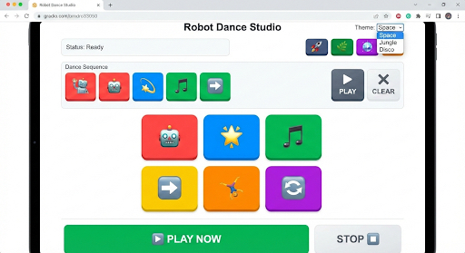

# Robot Dance Studio — UI Spec (Reachy Mini Remix v1)



## 1) Purpose

Build a lightweight web UI called **Robot Dance Studio** that lets a user:

1. Select **dance moves** (by clicking buttons).
2. Build a **dance sequence** as an ordered list.
3. **Play** the whole sequence.
4. **Clear** the sequence.
5. Optionally **Play Now** (quick run).
6. Switch **theme**.
7. Switch **Reachy mini app mode** (starting with **Reachy Remix**).

This is a “small now, scalable later” interface: the key requirement is **room for more move buttons** over time.

---

## 2) Screen Layout (Single Page)

### Top Header Row

* Centered title: **Robot Dance Studio**
* Right side: **Theme picker** dropdown.

  * Label: `Theme:`
  * Options shown in screenshot:

    * Space
    * Beach
    * Jungle
    * Disco

### Top Right: App Selector (NEW)

Under (or immediately adjacent to) the theme picker, add a compact **App Selector cluster**:

* Purpose: choose the current Reachy mini app context.
* Format: small square icon buttons (like in screenshot style).
* For v1:

  * Include at least:

    * **Reachy Remix** (active by default)
  * Allow placeholders for future apps:

    * Reachy Radio
    * Therimini
    * Face/Greeter
    * etc.

**Behavior**

* Only **Reachy Remix** needs to be functional in v1.
* Others can be disabled with tooltip: “Coming soon”.

---

## 3) Status Area

Below title area:

* A wide, subtle rounded box:

  * Label/value: **Status: Ready**
* Status states:

  * Ready
  * Recording / Building Sequence
  * Playing
  * Stopped
  * Error (if playback fails)

---

## 4) Sequence Builder Panel

### Panel Title

**Dance Sequence**

### Sequence Chips/Buttons Row

A horizontal row showing the **currently selected sequence items** as compact colored tiles.

* Each tile represents one move added to the sequence.
* Tiles display:

  * Emoji/icon representing the move.
  * Optional short label on hover.

**Interactions**

* Clicking a move button adds a tile to this row.
* Order matters.

### Actions (Right side of panel)

Two prominent square buttons:

1. **PLAY**
2. **CLEAR**

**PLAY**

* Plays the full sequence from first to last.
* Updates status to `Playing`.

**CLEAR**

* Clears the sequence row.
* Status returns to `Ready`.

---

## 5) Move Palette (Main Grid)

Centered large grid of **big square move buttons** (like the 2x3 layout in screenshot).

* Each button:

  * Has a bright color block background.
  * Contains a large emoji/icon.
  * Represents a move category or core move.

**Required v1 buttons (matching screenshot vibe)**

* Robot face
* Star
* Music note
* Forward/next arrow
* Acrobatic/flip icon
* Repeat/loop icon

These can map to:

* `pose_robot`
* `sparkle_hit`
* `music_groove`
* `step_forward`
* `flip_trick`
* `repeat_move`

(Exact naming flexible; UI should not hardcode to these names.)

---

## 6) Expandable Small Move Buttons (IMPORTANT)

Add a **secondary move section** with **many smaller buttons** so you can scale the library without redesign.

### Placement

Either:

* Under the large grid, or
* A collapsible section titled:

  * **More Moves**
  * **Move Library**
  * **Mini Moves**

### Requirements

* Supports:

  * 20+ buttons without layout breaking.
  * Responsive wrap.
* Each small button:

  * Emoji/icon first.
  * Optional tiny label.
  * Tooltip with move name.

---

## 7) Bottom Action Bar

Two primary control areas:

### Left: Big CTA

**PLAY NOW** (wide green button in screenshot)

**Behavior**

* Plays the current sequence.
* If the sequence is empty:

  * Either do nothing + status hint
  * Or play a default “demo mini-sequence”.

### Right: Stop Cluster

A white rounded box containing:

* **STOP** label
* Small square stop indicator/button

**Behavior**

* Immediately stops playback.
* Status changes to `Stopped`.

---

## 8) Theming

### Theme Picker

Dropdown in the upper-right.

**Themes**

* Space
* Beach
* Jungle
* Disco

**What themes affect**

* Background gradient or subtle pattern
* Accent colors for:

  * Button borders
  * Header underline
  * Panel outlines

**Constraints**

* Don’t change button iconography per theme.
* Keep accessibility readable.

---

## 9) App Mode Selector (NEW)

A compact icon-row near the theme area.

**Behavior**

* Selecting an app:

  * Changes the move catalog source.
  * Updates the header subtitle optionally:

    * e.g., “Mode: Reachy Remix”

**v1 Scope**

* Only **Reachy Remix** is functional.
* Others can be present but disabled.

---

## 10) Data Model (UI-facing)

### Move Definition

```json
{
  "id": "spin",
  "label": "Spin",
  "emoji": "🌀",
  "colorClass": "blue",
  "size": "large | small",
  "category": "dance | gesture | emotion | utility",
  "enabled": true
}
```

### Sequence

```json
{
  "items": ["spin", "wave", "sparkle_hit"]
}
```

---

## 11) Interaction Rules

1. Clicking a move button:

   * Adds that move to the sequence.
   * Appends to the right end.

2. PLAY (panel) and PLAY NOW (bottom):

   * Both trigger playback.
   * PLAY NOW is the “big obvious do it” button.

3. STOP:

   * Interrupts playback instantly.
   * Leaves sequence intact.

4. CLEAR:

   * Removes all sequence items.

5. Theme changes:

   * Do not reset sequence.

6. App mode changes:

   * Option A: clear sequence automatically.
   * Option B (preferred): prompt small toast:

     * “Sequence cleared for new mode.”

---

## 12) Responsiveness

* Desktop-first.
* Must scale down to tablet width:

  * Move grid wraps.
  * Small-move section becomes multi-row.
* Avoid horizontal scrolling unless absolutely necessary.

---

## 13) Visual Style Notes

* Rounded square buttons with subtle drop shadow.
* Bright, playful color blocks.
* Emoji-centric design (no heavy text on buttons).
* Clear hierarchy:

  * Big grid = “primary moves”
  * Small button area = “extended library”

---

## 14) Non-Goals for v1

* No user accounts.
* No saving sequences (unless trivial localStorage).
* No audio integration required.
* No hardware linking required in this UI spec.

---

## 15) Acceptance Criteria

* Theme dropdown in upper right with 4 options.
* App selector buttons present near theme; Reachy Remix enabled and default.
* Status field displays `Ready`, `Playing`, `Stopped`.
* Dance Sequence panel:

  * shows sequence tiles
  * has PLAY and CLEAR
* Large move grid present.
* Small move button area exists and supports growth.
* Bottom bar includes:

  * PLAY NOW
  * STOP control
* Sequence building and playback triggers are wired to callbacks/events.

---

## 16) Implementation Hints (Optional but Useful)

* Use a single `moves[]` array with `size` field to render into:

  * `primaryMoves = moves.filter(size=="large")`
  * `secondaryMoves = moves.filter(size=="small")`
* Use a `playSequence(sequenceIds)` callback interface so the UI stays decoupled from robot code.

